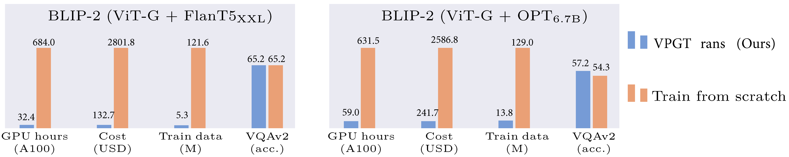
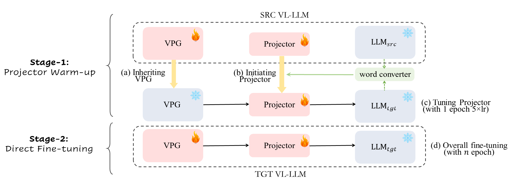
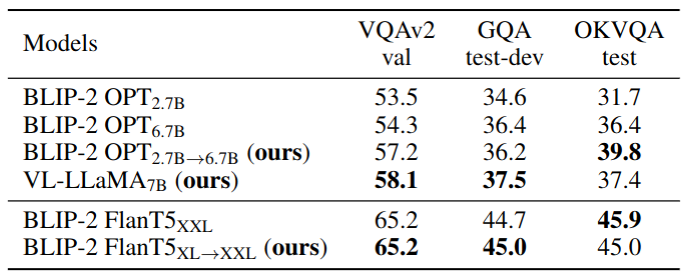
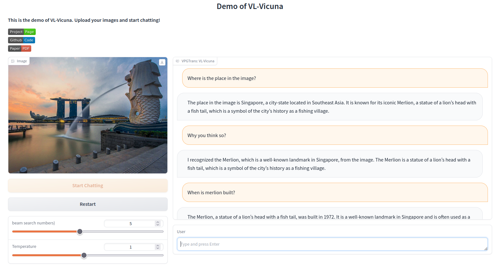

# VPGTrans: Transfer Visual Prompt Generator across LLMs
[Ao Zhang](https://waxnkw.github.io/), [Hao Fei](https://haofei.vip/)\*, [Yuan Yao](https://yaoyuanthu.github.io/)\*, [Wei Ji](https://jiwei0523.github.io/), [Li Li](https://vpgtrans.github.io/), [Zhiyuan Liu](http://nlp.csai.tsinghua.edu.cn/~lzy/) and [Tat-Seng Chua](https://www.chuatatseng.com/).  (*Correspondence )

**National University of Singapore**, **Tsinghua University**

Project page: [VPGTrans](https://vpgtrans.github.io/)

This repo contains all the source codes for the proposed methods and the two newly-built VL-LLMs.

-----------

<a href='https://vpgtrans.github.io/'></a>  <a href='https://github.com/VPGTrans/VPGTrans/blob/main/vpgtrans.pdf'></a>  <a href='https://ee569fe29733644a33.gradio.live'></a> 

## What's New: 🎉 
- [x] 2023.05.01 Rlease the code.

## Table of Contents
  - [Introduction](#introduction)
    - [VL-LLaMA](#vl-llama)
    - [VL-Vicuna](#vl-vicuna)
  - [Installation](#installation)
  - [VL-Vicuna Demo](#vl-vicuna-demo)
  - [Evaluation](#evaluation)
  - [Training](#training)
    - [VL-LLaMA Training](#vl-llama-training)
    - [VL-Vicuna Training](#vl-vicuna-training)
  -  [Acknowledgement](#acknowledgement)
  - [License](#license)

## Introduction

While developing a new vision-language LLM (VL-LLM) by pre-training on tremendous image-text pairs from scratch can be exceedingly resource-consuming, connecting an existing LLM with a comparatively lightweight visual prompt generator (VPG) becomes a feasible paradigm. 
However, further tuning the VPG part of the VL-LLM still suffers from indispensable computational costs.

In this project, we develop a VPGTrans framework for transferring VPG across LLMs to build VL-LLMs at significantly lower cost.
The GPU hours can be reduced over 10 times and the training data can be reduced to around 10%:
[](https://github.com/VPGTrans/VPGTrans)

VPGTrans comprises two stages of training:
[](https://github.com/VPGTrans/VPGTrans)

The most exciting thing is that VPGTrans enables to **customize new VL-LLMs with newly released LLMs**.
In this project, we release two novel VL-LLMs via our VPGTrans, including **VL-LLaMA** and **VL-Vicuna**.

### VL-LLaMA
We customize a **VL-LLaMA**, a multimodal version LLaMA by transferring the BLIP-2 OPT-6.7B to LLaMA via VPGTrans.
The performance of **VL-LLaMA** is summarized as follow:
<div>
  <a></a>
  <br><br><br><br><br><br><br><br><br>
</div>


### VL-Vicuna
We also build a GPT-4-like multimodal chatbot, **VL-Vicuna**, based on the Vicuna LLM.
Checkout our demo of VL-Vicuna:
[](https://vpgtrans.github.io/)  


## Installation
**1. Prepare the code**

```bash
git clone https://github.com/VPGTrans/VPGTrans.git
cd VPGTrans
pip install -r requirements.txt
pip install -e .
```


## VL-Vicuna Demo

**1. Prepare the pretrained Vicuna weights**  
To run VL-Vicuna locally, you need to first prepare the  
The current version of VL-Vicuna is built on the v0 versoin of Vicuna-7B.
Please refer to the instruction [here](PrepareVicuna.md) 
to prepare the Vicuna weights.
The final weights would be in a single folder in a structure similar to the following:

```
vicuna_weights
├── config.json
├── generation_config.json
├── pytorch_model.bin.index.json
├── pytorch_model-00001-of-00003.bin
...   
```
 
**2. Run the code**  
Please modify the `llama_model`
[lavis/projects/blip2/demo/vl_vicuna_demo.yaml](lavis/projects/blip2/demo/vl_vicuna_demo.yaml)
line 12 to your vicuna checkpoint.   

Then, run:
```bash
python webui_demo.py --cfg-path lavis/projects/blip2/demo/vl_vicuna_demo.yaml  --gpu-id 0
```

Note the checkpoint will be automatically downloaded.

## Evaluation

**Prepare the data**  
Please first refer to [here](prepare_data/README.md) to prepare the dataset you want to evaluate.
We use COCO caption, NoCaps, VQAv2, GQA, and OK-VQA in our paper.

### VL-LLaMA Evaluation
**1. Prepare the pretrained LLaMA weights**  
LLaMA checkpoint is the start of Vicuna.
Please also refer to the instruction [here](PrepareVicuna.md) 
to prepare the LLaMA weights.

**2. Run the code**  
Please run:
```bash
bash run_scripts/blip2/scale_up_eval/eval_vqa_llama.sh /path/to/llama_7b_dir/ # zero-shot vqav2 eval
bash run_scripts/blip2/scale_up_eval/eval_gqa_llama.sh /path/to/llama_7b_dir/ # zero-shot gqa eval
bash run_scripts/blip2/scale_up_eval/eval_okvqa_llama.sh /path/to/llama_7b_dir/ # zero-shot okvqa eval
```

[//]: # (### BLIP-2 OPT 6.7B Evaluation)
[//]: # (### BLIP2 FlanT5-XXL Evaluation)

## Training
The stage-1 pre-training requires COCO caption and SBU.
The stage-2 also requires VG caption and Laion-COCO.
Please refer to [here](prepare_data/README.md) for data downloading.  

If you want to remove some datasets in the training.
Please comment the items in the config file, like:
```yaml
# lavis/projects/blip2/train/llama_vpgtrans_step1_proj_warmup.yaml
datasets:
  coco_caption:
    vis_processor:
        train:
          name: "blip2_image_train"
          image_size: 224
        eval:
          name: "blip_image_eval"
          image_size: 224
    text_processor:
        train:
          name: "blip_caption"
        eval:
          name: "blip_caption"
#  the SBU will not be used in the pre-training
#  sbu_caption:
#    vis_processor:
#        train:
#          name: "blip2_image_train"
#          image_size: 224
#    text_processor:
#        train:
#          name: "blip_caption"
```

### VL-LLaMA Training

**1. Stage-1 Projector Warm-up**  
First, you need to download the [BLIP2 OPT-6.7B checkpoint](https://storage.googleapis.com/sfr-vision-language-research/LAVIS/models/BLIP2/blip2_pretrained_opt6.7b.pth).

The 1st thing is to initialize the projector with word convertor. (Optional)
```bash
CUDA_VISIBLE_DEVICES=0 python tools/linear_proj/train_linear_proj_opt_and_llama.py \
  facebook/opt-6.7b \
  /path/to/llama_7b_dir/ \
  /path/to/blip2_opt6.7b_ckpt \
  /path/to/output_dir
# example:
# CUDA_VISIBLE_DEVICES=0 python tools/linear_proj/train_linear_proj_opt_and_llama.py \
#   facebook/opt-6.7b \
#   ./llama-7b/ \
#   ./blip2_pretrained_opt6.7b.pth  \
#   ./lavis/output/proj_init
```  
Then, run the projector warm-up:
```bash
bash run_scripts/blip2/scale_up_train/llama_vpgtrans_step1_proj_warmup.sh \
  /path/to/blip2_opt6.7b_ckpt \
  /path/to/projector_init_weight \
  /path/to/llama_7b_dir/
 # example:
# bash run_scripts/blip2/scale_up_train/llama_vpgtrans_step1_proj_warmup.sh \
#  ./blip2_pretrained_opt6.7b.pth \
#  ./lavis/output/proj_init/xxx.pth \
#  ./llama-7b/
```

**2. Stage-2 Direct Fine-tuning**  
Please run:
```bash
bash run_scripts/blip2/scale_up_train/llama_vpgtrans_step2_direct_finetune.sh \
  /path/to/blip2_opt6.7b_ckpt \
  /path/to/stage1_proj_warmup_checkpoint \
  /path/to/llama_7b_dir/
 # example:
# bash run_scripts/blip2/scale_up_train/llama_vpgtrans_step2_direct_finetune.sh \
#  ./blip2_pretrained_opt6.7b.pth \
#  ./lavis/output/vl-llama_stage1/checkpoint_0.pth \
#  ./llama-7b/
```

### VL-Vicuna Training
Vicuna is the instruction-tuning version of LLaMA.
Most of the scripts are similar with training LLaMA.

**1. Stage-1 Projector Warm-up**  
First, you need to download the [BLIP2 OPT-6.7B checkpoint](https://storage.googleapis.com/sfr-vision-language-research/LAVIS/models/BLIP2/blip2_pretrained_opt6.7b.pth).

The 1st thing is to initialize the projector with word convertor. (Optional)
```bash
CUDA_VISIBLE_DEVICES=0 python tools/linear_proj/train_linear_proj_opt_and_llama.py \
  facebook/opt-6.7b \
  /path/to/vicuna_7b_dir/ \
  /path/to/blip2_opt6.7b_ckpt \
  /path/to/output_dir
# example:
# CUDA_VISIBLE_DEVICES=0 python tools/linear_proj/train_linear_proj_opt_and_llama.py \
#   facebook/opt-6.7b \
#   ./vicuna-7b/ \
#   ./blip2_pretrained_opt6.7b.pth  \
#   ./lavis/output/proj_init
```  
Then, run the projector warm-up:
```bash
bash run_scripts/blip2/scale_up_train/llama_vpgtrans_step1_proj_warmup.sh \
  /path/to/blip2_opt6.7b_ckpt \
  /path/to/projector_init_weight \
  /path/to/vicuna_7b_dir/
 # example:
# bash run_scripts/blip2/scale_up_train/llama_vpgtrans_step1_proj_warmup.sh \
#  ./blip2_pretrained_opt6.7b.pth \
#  ./lavis/output/proj_init/xxx.pth \
#  ./vicuna-7b/
```

**2. Stage-2 Direct Fine-tuning**  
Please run:
```bash
bash run_scripts/blip2/scale_up_train/llama_vpgtrans_step2_direct_finetune.sh \
  /path/to/blip2_opt6.7b_ckpt \
  /path/to/stage1_proj_warmup_checkpoint \
  /path/to/vicuna_7b_dir/
 # example:
# bash run_scripts/blip2/scale_up_train/llama_vpgtrans_step2_direct_finetune.sh \
#  ./blip2_pretrained_opt6.7b.pth \
#  ./lavis/output/vl-vicuna_stage1/checkpoint_0.pth \
#  ./vicuna-7b/
```

**3. Stage-3 Visual Instruction Tuning**  
To align with conversation scenario, we conduct a short tuning using MiniGPT-4's self-instruct data (around 3,000 images).
Please refer to [instruction](prepare_data/README.md) for downloading it.
Please run:
```bash
bash run_scripts/blip2/scale_up_train/vicuna_vpgtrans_step3_self_instruct.sh \
  /path/to/stage2_direct_tuning_checkpoint \
  /path/to/vicuna_7b_dir/
 # example:
# bash run_scripts/blip2/scale_up_train/vicuna_vpgtrans_step3_self_instruct.sh \
#  ./lavis/output/vl-vicuna_stage2/checkpoint_50000.pth \
#  ./vicuna-7b/
```


## Acknowledgement

+ [Lavis](https://github.com/salesforce/LAVIS) This repository is built upon Lavis!
+ [Vicuna](https://github.com/lm-sys/FastChat) We build the model based.
+ [MiniGPT-4](https://github.com/Vision-CAIR/MiniGPT-4) The web UI and part of README are based on MiniGPT-4.


If you're using VPGTrans in your research or applications, please cite using this BibTeX:
```bibtex
@article{2023vpgtrans,
  author      = {Ao Zhang and Hao Fei and Yuan Yao and Wei Ji and Li Li and Zhiyuan Liu and Tat-Seng Chua},
  title       = {Transfer Visual Prompt Generator across LLMs},
  journal      = {CoRR},
  volume       = {abs/23045.01278},
  year         = {2023},
  url          = {https://doi.org/10.48550/arXiv.2305.01278},
}
```

## License
[BSD 3-Clause License](LICENSE.txt)
